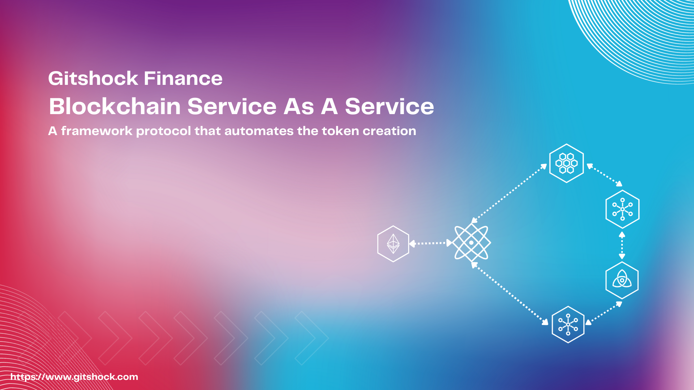

# Neware-Chain




**GTFX** is a blockchain built using Cosmos SDK and Tendermint and created with [Ignite CLI](https://ignite.com/cli).
To learn how the Cosmos SDK works from a high-level perspective, see the Cosmos SDK [High-Level Intro](./docs/intro/overview.md).
The Cosmos SDK is a framework for building blockchain applications. [Tendermint Core (BFT Consensus)](https://github.com/tendermint/tendermint) and the Cosmos SDK are written in the Golang programming language. Cosmos SDK is used to build [Gaia](https://github.com/cosmos/gaia), the first implementation of the Cosmos Hub.

**WARNING**: The Cosmos SDK has mostly stabilized, but we are still making some
breaking changes.

**Note**: Requires [Go 1.18+](https://go.dev/dl)


## Get started

```
ignite chain serve
```

`serve` command installs dependencies, builds, initializes, and starts your blockchain in development.

### Configure

Your blockchain in development can be configured with `config.yml`. To learn more, see the [Ignite CLI docs](https://docs.ignite.com).

### Web Frontend

Ignite CLI has scaffolded a Vue.js-based web app in the `vue` directory. Run the following commands to install dependencies and start the app:

```
cd vue
npm install
npm run serve
```

The frontend app is built using the `@starport/vue` and `@starport/vuex` packages. For details, see the [monorepo for Ignite front-end development](https://github.com/ignite/web).

## Release
To release a new version of your blockchain, create and push a new tag with `v` prefix. A new draft release with the configured targets will be created.

```
git tag v0.1
git push origin v0.1
```

After a draft release is created, make your final changes from the release page and publish it.

### Install
To install the latest version of your blockchain node's binary, execute the following command on your machine:

```
curl https://get.ignite.com/username/gtfx@latest! | sudo bash
```
`username/gtfx` should match the `username` and `repo_name` of the Github repository to which the source code was pushed. Learn more about [the install process](https://github.com/allinbits/starport-installer).

## Learn more

- [Ignite CLI](https://ignite.com/cli)
- [Tutorials](https://docs.ignite.com/guide)
- [Ignite CLI docs](https://docs.ignite.com)
- [Cosmos SDK docs](https://docs.cosmos.network)
- [Developer Chat](https://discord.gg/ignite)
